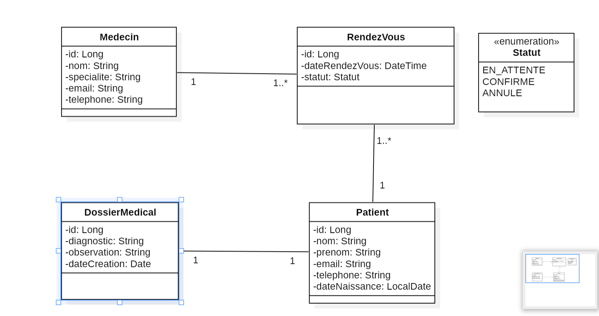
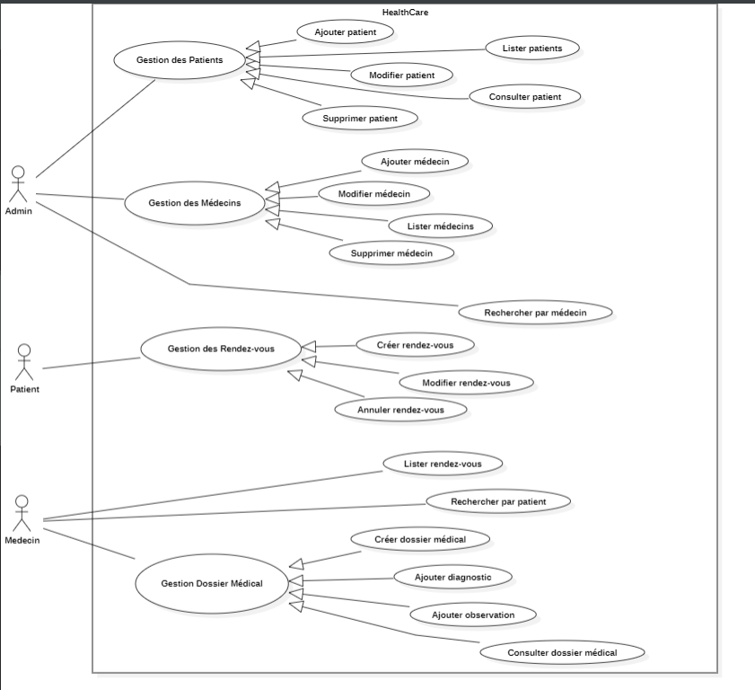
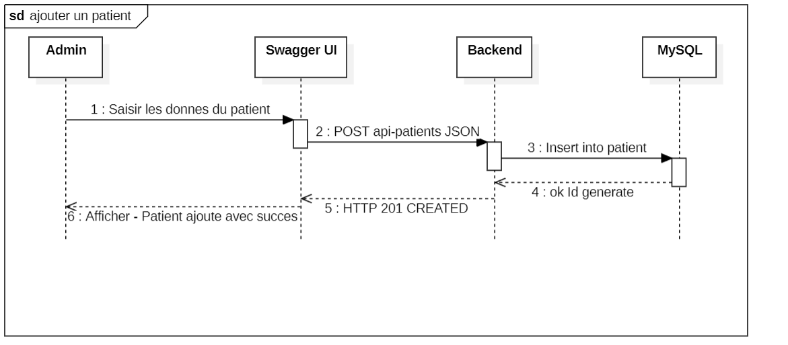
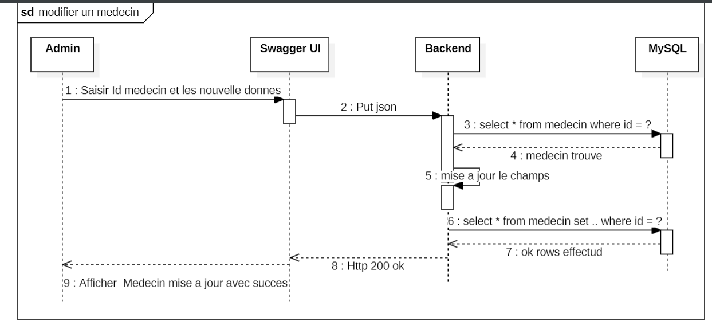
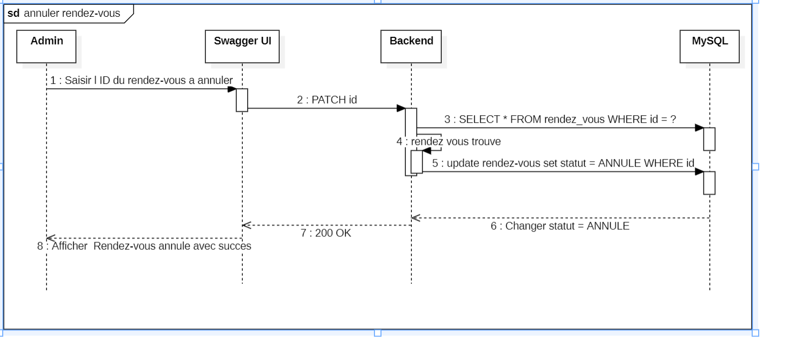
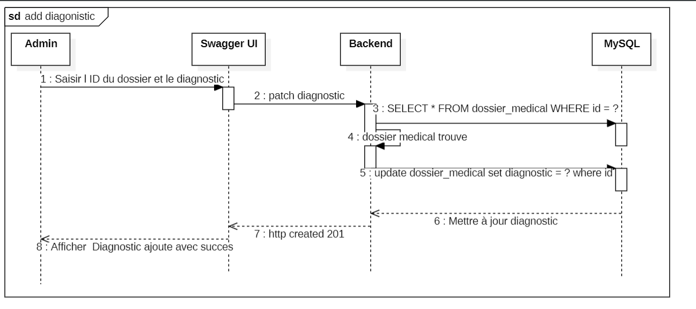

# HealthCare+ — Système de Gestion Médicale

API REST complète pour la gestion des patients, médecins, rendez-vous et dossiers médicaux.

## Description

HealthCare+ est une application backend de gestion de système médical développée dans le cadre de la transformation numérique d'une entreprise spécialisée dans le domaine de la santé.
L'application expose une API REST permettant de gérer :

* Les patients (création, modification, suppression, consultation)
* Les médecins (CRUD complet)
* Les rendez-vous (planification, annulation, recherche)
* Les dossiers médicaux (création, ajout de diagnostics et observations)

Le projet est bâti sur une architecture **MVC** robuste, garantissant scalabilité et maintenabilité, tout en respectant les standards de l'industrie logicielle.

##  Technologies Utilisées
*   **Backend:** Java 21 & Spring Boot 3.3.2
*   **Base de données:** MySQL & Hibernate (JPA)
*   **Migration DB:** Flyway
*   **Mapping:** MapStruct (DTO Pattern)
*   **Documentation:** Swagger 
*   **Outils:** Lombok, Maven, Docker
*   **Tests:** JUnit 5

##  Architecture du Projet
L'application suit une architecture en couches (MVC) :
*   **Controller:** Points d'entrée REST.
*   **Service:** Logique métier et règles de gestion.
*   **Repository:** Accès aux données avec Spring Data JPA.
*   **Entity:** Modélisation de la base de données.
*   **DTO:** Transfert de données sécurisé entre couches.
*   **Mapper:** Conversion fluide entre Entités et DTOs.

**Diagramme de Classes :** Modélisation des entités et leurs relations (OneToMany, ManyToOne).

**Diagramme de Cas d'Utilisation :** Analyse des besoins acteurs (Admin, Médecin, Patient).

**Diagramme de Séquence :** Flux d'exécution pour les processus critiques.

