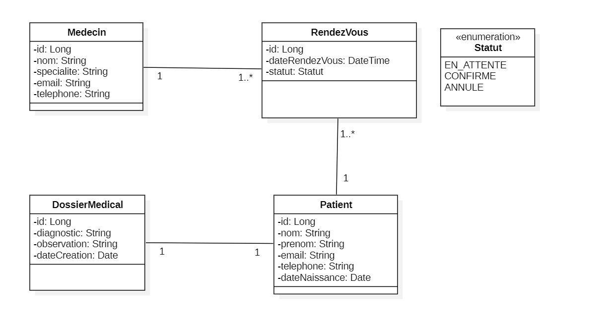
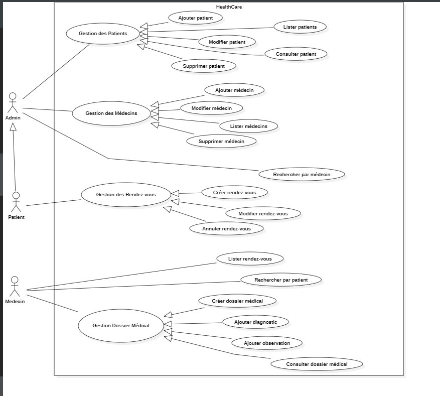
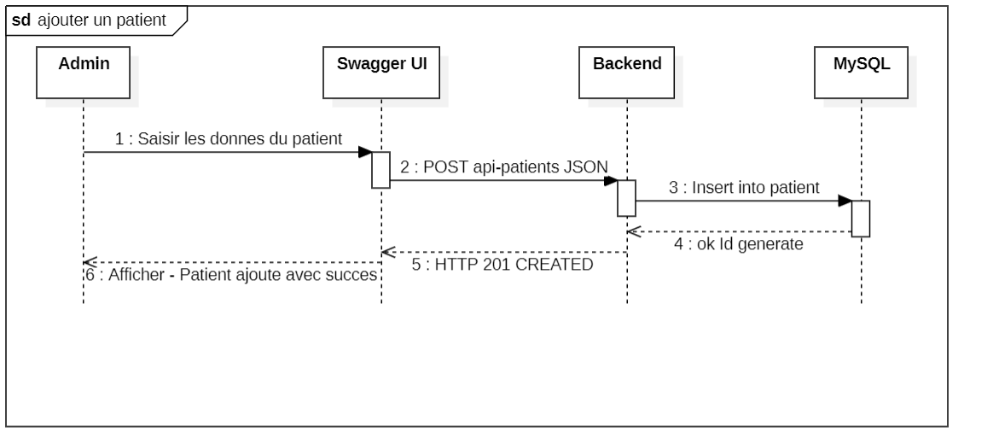
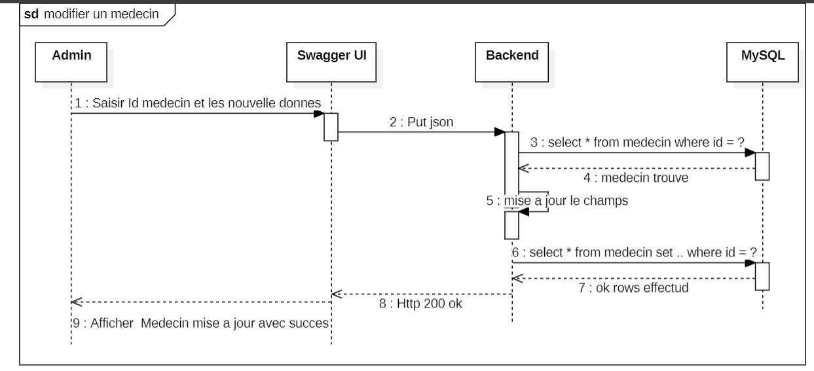
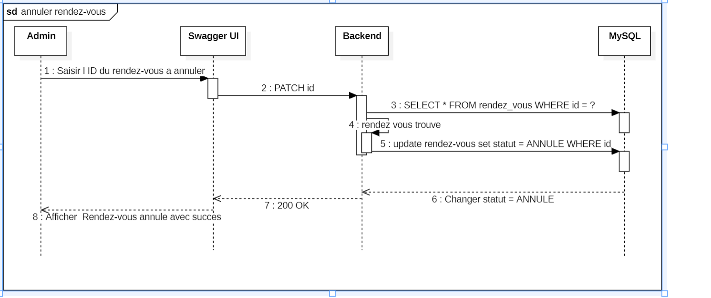
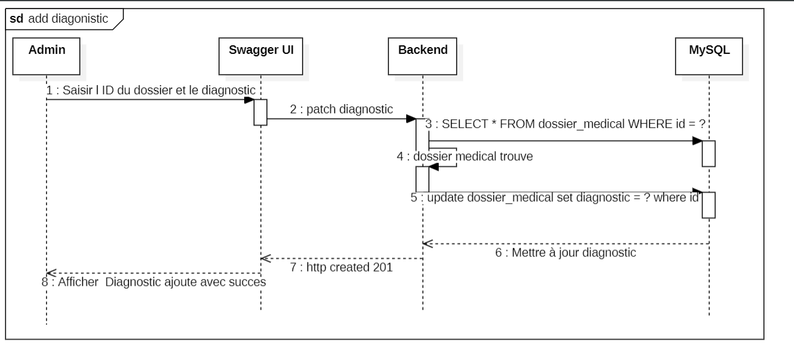
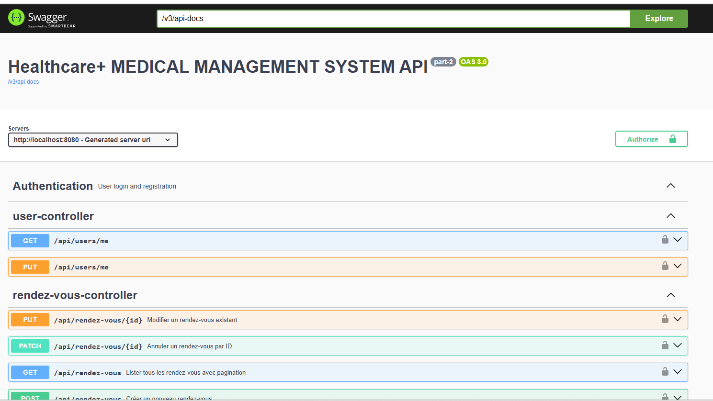

# 🏥 HealthCare+ - Système de Gestion Médicale

## 1. Présentation du projet

HealthCare+ est une application web de gestion médicale développée pour faciliter la gestion des patients, des médecins, des rendez-vous et des dossiers médicaux au sein d'une clinique.

Elle s'adresse principalement aux administrateurs, aux médecins et au personnel médical souhaitant centraliser les informations médicales dans une plateforme sécurisée.

L'objectif principal est de digitaliser la gestion des données médicales tout en garantissant la sécurité, la performance et la simplicité d'utilisation grâce à une API REST moderne développée avec Spring Boot.

---

# 2. Problématique

Dans de nombreuses structures médicales, les informations concernant les patients, les rendez-vous et les dossiers médicaux sont souvent dispersées ou gérées manuellement, ce qui augmente le risque d'erreurs et ralentit le travail du personnel.

HealthCare+ apporte une solution centralisée permettant de gérer efficacement toutes les informations médicales, de sécuriser les accès selon les rôles des utilisateurs et d'améliorer les performances grâce à plusieurs mécanismes d'optimisation.

---

# 3. Fonctionnalités principales

- Créer, modifier et supprimer des patients
- Gérer les médecins
- Planifier, modifier et annuler des rendez-vous
- Gérer les dossiers médicaux
- Créer un compte utilisateur
- Se connecter avec authentification JWT
- Gérer les rôles (ADMIN, MEDECIN, PATIENT)
- Sécuriser les accès avec Spring Security
- Effectuer des recherches paginées
- Trier les résultats
- Mettre en cache certaines données avec Redis
- Télécharger des fichiers médicaux
- Générer automatiquement la documentation Swagger
- Déployer l'application avec Docker et Docker Compose
- Automatiser les tests et le build avec GitHub Actions

---

# 4. Technologies utilisées

| Technologie | Utilisation |
|-------------|-------------|
| Java 21 | Langage principal |
| Spring Boot 3.3 | Développement de l'API REST |
| Spring Security | Authentification et autorisation |
| JWT | Sécurisation des utilisateurs |
| Spring Data JPA | Accès aux données |
| Hibernate | ORM |
| MySQL | Base de données |
| Flyway | Gestion des migrations |
| MapStruct | Conversion Entity ↔ DTO |
| Lombok | Réduction du code répétitif |
| Maven | Gestion des dépendances |
| Redis | Mise en cache |
| Docker | Conteneurisation |
| Docker Compose | Orchestration des services |
| GitHub Actions | Pipeline CI/CD |
| Swagger OpenAPI | Documentation de l'API |
| JUnit 5 | Tests unitaires |

---

# 5. Architecture

Le projet suit une architecture MVC en couches.

```
Controller
      │
      ▼
Service
      │
      ▼
Repository
      │
      ▼
MySQL
```

Les DTO et MapStruct permettent de séparer les entités de la couche de présentation.

L'application est organisée comme suit :

```
controller
service
repository
entity
dto
mapper
config
security
cache
upload
exception
```

---

# 6. Sécurité

L'application est protégée grâce à Spring Security et JWT.

Les fonctionnalités de sécurité comprennent :

- Authentification JWT
- Autorisation basée sur les rôles
- Protection des endpoints REST
- BCrypt pour le chiffrement des mots de passe
- Filtre JWT personnalisé
- Gestion des accès via Spring Security

Rôles disponibles :

- ADMIN
- MEDECIN
- PATIENT

---

# 7. Optimisations

Cette nouvelle version intègre plusieurs améliorations.

## Pagination

Toutes les listes sont paginées.

## Tri

Possibilité de trier les données.

## Recherche

Recherche paginée.

## Cache Redis

Les données fréquemment consultées sont stockées dans Redis afin d'améliorer les performances.

## Upload de fichiers

Les utilisateurs peuvent téléverser des documents médicaux.

## EntityGraph

Optimisation des requêtes JPA afin d'éviter le problème N+1.

---

# 8. Documentation API

Swagger permet de tester facilement tous les endpoints.

```
http://localhost:8080/swagger-ui/index.html
```

---

# 9. Installation

## Prérequis

- Java 21
- Maven
- Docker
- Docker Compose
- MySQL
- Redis
- Git

---

## Cloner le dépôt

```bash
git clone https://github.com/votre-compte/HealthCare-System.git
```

---

## Ouvrir le projet

```bash
cd HealthCare-System
```

---

## Variables d'environnement

Créer un fichier `.env`

```env
MYSQL_DATABASE=healthcare_db
MYSQL_USER=root
MYSQL_PASSWORD=*******
JWT_SECRET=***********************
```

---

## Lancer avec Docker

```bash
docker compose up --build
```

---

L'API sera disponible sur

```
http://localhost:8080
```

Swagger :

```
http://localhost:8080/swagger-ui/index.html
```

---

# 10. Pipeline CI/CD

Le projet utilise GitHub Actions afin d'automatiser :

- Compilation du projet
- Exécution des tests
- Build Maven
- Construction de l'image Docker

Chaque Push déclenche automatiquement le pipeline.

---

# 11. Diagrammes

## Diagramme de classes

;

---

## Diagramme de cas d'utilisation



---

## Diagramme de séquence






---

# 12. Captures d'écran

## Swagger



---

# 13. Contribution personnelle

Au cours de ce projet, j'ai participé au développement complet du backend.

Mes principales contributions :

- Conception de la base de données
- Développement des API REST
- Implémentation du CRUD complet
- Authentification avec JWT
- Gestion des rôles utilisateurs
- Sécurisation avec Spring Security
- Pagination et tri
- Intégration de Redis
- Téléchargement de fichiers
- Configuration Docker
- Mise en place du pipeline GitHub Actions
- Documentation Swagger
- Tests unitaires avec JUnit

---

# 14. Difficultés rencontrées

## Spring Security

### Problème

Les routes sécurisées retournaient des erreurs 403 Forbidden.

### Solution

Configuration correcte des filtres JWT, des rôles et des permissions.

### Apprentissage

Compréhension du fonctionnement interne de Spring Security.

---

## Docker Compose

### Problème

Les services ne communiquaient pas correctement entre eux.

### Solution

Configuration du réseau Docker, des variables d'environnement et des dépendances entre conteneurs.

### Apprentissage

Maîtrise du déploiement d'une application multi-conteneurs.

---

## Redis

### Problème

Les données n'étaient pas correctement mises en cache.

### Solution

Configuration du CacheManager et des annotations `@Cacheable`.

### Apprentissage

Compréhension des mécanismes de cache avec Spring Boot.

---

# 15. Améliorations futures

Dans une prochaine version, il serait possible de :

- Ajouter des notifications par email
- Intégrer un système de paiement
- Générer automatiquement des ordonnances PDF
- Ajouter des statistiques avancées
- Déployer sur AWS ou Azure
- Mettre en place une surveillance avec Prometheus et Grafana
- Ajouter des tests d'intégration
- Développer une application mobile

---

# 16. Auteur

**Hiba Hajaji**

Développeuse Full Stack Java

- Java
- Spring Boot
- Spring Security
- React
- MySQL
- Docker
- Redis
- GitHub Actions

---
